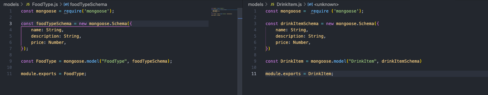

# POS-Upgrade-Backend

### All Current Routes
- **/menu** : Shows all menu items
- **/menu/food-specifications** : Shows specifications for food items
- **/menu/drink-specifications** : Shows specifications for drink items
- **/foods** : Shows all food items
 - **/foods/breakfast** : Shows all food items labelled with Breakfast in the foodType
 - **/foods/lunches** : Shows all food items labelled with Breakfast in the foodType
 - **/foods/dinners** : Shows all food items labelled with Dinner in the foodType
 - **/foods/desserts** : Shows all food items labelled with Dessert in the foodType
 - **/foods/pastries** : Shows all food items labelled with Pastry in the foodType
 - **/foods/vegetaria**n : Shows all food items labelled with Vegetarian in the foodType
 - **/foods/soups** : Shows all food items labelled with Soup in the foodType
 - **/foods/Salads** : Shows all food items labelled with Breakfast in the foodType
 - **/drinks/coffees** : Shows all food items labelled with Coffee in the foodType
 - **/drinks/sodas** : Shows all food items labelled with Soda in the foodType
 - **/drinks/alcohol** : Shows all food items labelled with Alcohol in the foodType

### Some Code Snippets


The Main menu set up for the API, this one displays all the Menu items in an array
```
app.get("/menu", async (request, response) => {
  try {
    const menuArray = await Menu.find({});
    console.log("Menu Loaded");
    response.json({ menuArray });
  } catch (error) {
    response.status(500).send(error);
  }
});
```


This code snippet is for a more specified route to show only items tagged with Pastry so that specific menu pages will only show what's relevant. 
```
app.get("/foods/pastries", async (request, response) => {
  try {
    const menuArray = await Menu.find({});
    const foodsArray = menuArray[1].foodItems.filter((food) => { 
      return food.foodType.includes("Pastry")
    })
    console.log("Pastries Loaded")
    response.json({ foodsArray });
  } catch (error) {
    response.status(500).send(error);
  }
});
```


This was a snippet for pushing items into the menu to avoid re-inputting the menu each time I wanted to add something new. I just had to swap out the drinkItems.push for any of the other categories such as foodItems.push or foodTypes.push
```
Menu.findById("61dca73126e107d66f4c7c2c")
.then((menu) => {
    menu.drinkItems.push(
        {
        name: "Cola",
        category: "Soda",
        description: "Really bad for your teeth",
        price: 3,
        foodType: ["Drink", "Soda"],
        options: ["Small", "Medium", "Large", "In House", "ToGo"]
        }
   )
    menu.save()
    console.log(menu.specificationDrinks);
})
```

### The Models

So while a lot of models are available, the Menu Model was the only one used for the API itself. 


There's also the User model for when people log in. 


I made seperate models for food items and drink items but we decided to go with an Embedded format instead. I held on to them in case we wanted to make a jump to a Referenced format. 



### Thank you for taking the time to read this! *Cheers~*